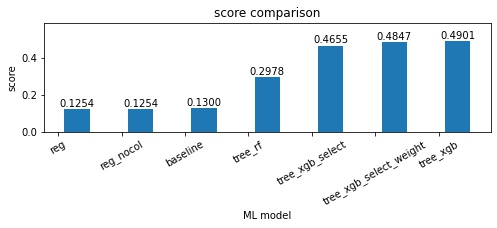
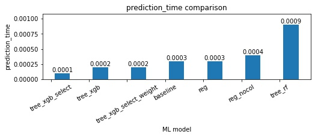

# Demo

## Autores
* [Marcelo B. Barata Ribeiro](https://www.linkedin.com/in/marcelobarataribeiro/)
* [Franklin Oliveira](https://www.github.com/Franklin-oliveira)

## Base de dados
<!-- * https://www.kaggle.com/mlg-ulb/creditcardfraud -->
* https://www.kaggle.com/c/ieee-fraud-detection/data
    * data definition: https://www.kaggle.com/c/ieee-fraud-detection/discussion/101203

## Introdução
<!-- Além da métrica de score a ser definida, diversas outras medidas são importantes para o processo decisório
* Velocidade de treinamento do modelo. Além disso, custo da amostragem dos dados em termos de score vs. ganho em velocidade de treinamento. 
* Velocidade de predição. 
* Qual é o grau de interpretabilidade exigido?
* Qual é o prazo? O que teria maior peso se considerar o tradeoff entre qualidade (ou complexidade do modelo) e velocidade de entrega? 
* Ter um modelo facilmente replicável e adaptável para outro projetos é mais ou menos importante do que utilizar o estado da arte? Quanto tempo estamos dispostos a dedicar para a parte técnica?

Cada um desses pontos depende da percepção do negócio e suas respectivas prioridades. Não existe uma bala de prata. Por exemplo, há casos em que modelos de Deep Learning se adequam bem, mas em diversas situações seria uma estratégia equivocada. Quando é priorizada interpretabilidade e velocidade de elaboração e produtização, modelos de árvore (Random Forest, XGBoost, etc) e regressão linear (Logística, com regularização Lasso ou Ridge, etc) podem se adequar melhor. É por isso que, assumindo a priorização da interpretabilidade, me basearei em apenas 3 modelos: Random Forest, XGBoost e Regressão ElasticNet. Além disso, apliquei XGboost também para avaliar feature importances (junto a outras técnicas para escolha de variáveis).

O projeto foi organizado numa série de notebooks, seguindo o princípio de Separation of Concerns (SoC), ou seja, priorizei a modularização de modo que cada componente seja centrado num conjunto específico e intuitivo de operações, o que facilita a navegação por parte de outros usuários, assim como a adaptação e debugging do código. O modelo de organização de pasta é similar ao indicado no link a seguir: [how to structure a python based data science project](https://medium.com/swlh/how-to-structure-a-python-based-data-science-project-a-short-tutorial-for-beginners-7e00bff14f56)

Uma diversidade de técnicas voltadas para modelagem, EDA e pré-processamento foi utilizada ao longo dos notebooks. Uma breve listagem pode ser elaborada abaixo:
* Visualizações de boxplots, histogramas, correlation matrix.
* Hyperparameter tuning por meio de GridSearch.
* k-fold cross-validation.
* Encoding: 
* Isolation Forest para lidar com anomalias
* Deixei no código funções para dois tipos de imputação de dados faltantes : KNN e via mediana. 
* Feature selection: Feature importances do XGboost, correlation matrix, medida de multicolinearidade via VIF, visualizações.
* Processo decisório com manipulação e ordenamento das predições -->
<!-- * Simulação da qualidade de amostragem -->

## Estrutura
O projeto foi organizado de uma forma linear de modo a facilitar a navegação e compreensão do passo a passo.

```bash
.
├── data
│   ├── 01_raw
│   │   ├── ...
│   ├── 02_intermediate
│   ├── ├── ...
│   │   03_processed
│   │   ├── ...
│   ├── 04_models
│   │   ├── ...
│   ├── 05_model_output
│   │   ├── ...
│   ├── 06_reporting
│   │   ├── ...
│   ├── 07_prediction
│   │   ├── ...
│   ├── temp
│   │   ├── ...
├── notebooks
│   ├── 01_data_validation.ipynb
│   ├── 02_split.ipynb
│   ├── 03_eda_cleansing.ipynb
│   ├── 04_encoding.ipynb
│   ├── 05_1_check_collinearity.ipynb
│   ├── 06_model_linear.ipynb
│   ├── 06_model_tree_rf.ipynb
│   ├── 06_model_tree_xgboost.ipynb
│   ├── 07_model_selection.ipynb
│   ├── 08_final_model.ipynb
│   ├── sandbox05_2_feature_engineering.ipynb
├── src
│   ├── model.py
│   ├── params.py
│   ├── s03_encoding.py
│   ├── s04_1_feature_engineering.py
│   ├── utils.py
├── temp
├── README.md
├── requirements.txt
└── runtime.txt


```

## Observações sobre arquivos

### Raw data

#### from case


#### others


### Data pipeline


### Notebooks

### Scripts python 
* model.py: funções voltadas para modelos de Machine Learning
* params.py: parâmetros principais do projeto
* s03_encoding.py: seção não utilizada, mas análoga ao s03_encoding.ipynb
* s05_2_feature_engineering.py: diversas funções que formulam pré-processamento e alimentam parte de modelagem
* utils.py: funções genéricas, mas aplicadas ao longo de notebooks diversos do projeto

### pdfs
Reports over datasets and case.

### temp

## Requerimentos
Esse projeto usa Python 3.7.5 e os seguintes pacotes devem ser instalados se não estiver usando uma distribuição como Anaconda:

> impyute - matplotlib - numpy - pandas - scipy - seaborn - scikit-learn - statsmodels - xgboost


Os pacotes podem ser automaticamente instalados por meio do arquivo requirements.txt. Para utilizá-los, é necessário criar um ambiente virtual, por exemplo via virtualenv e rodar o seguinte código no terminal:
```sh
pip install -r requirements.txt
```
Lembrando que IDEs como pycharm automatizam toda essa tarefa.

### Python
Para trabalhar com os arquivos, é necessário ter jupyter notebook instalado (se possuir distribuições como anaconda, pode pular esse passo). Para instalar, digite no terminal:
```sh
sudo apt update
pip install jupyter
```

## Considerações
Um projeto de machine learning demanda cuidado minucioso sobre diversas etapas. Abaixo, fiz um fluxograma (via figma) de um projeto usual:


O modelo final utilizado foi um xgboost com um set específico de hiperparâmetros e features. O score, seja ele acurácia, precisão, recall, f1, não é o único fator relevante para a tomada de decisão. Interpretabilidade, velocidade de treinamento e de predição também podem ser relevantes a depender de cada problema de negócio com o qual as empresas se deparam.

Segue abaixo gráficos comparativos da performance de cada modelo:






Obs: diferenças de velocidade dependem não apenas do modelo escolhido, mas também  da configuração do hyperparameter tuning.

Os notebooks possuem análises mais detalhadas de acordo com cada etapa.

O racional para decisões quanto a escolha do modelo e estratégias sugeridas será demonstrado na apresentação.

## Caminhos possíveis de melhorias
* Customizar pipeline de pré-processamento dentro do sklearn para garantir eficácia da validação dos modelos
* adicionar docstrings
* adicionar testes unitários
* refatorar código (com assistência de IDEs como pycharm)
* preparar código para produção
* implementar modelo na nuvem (AWS, GCP ou Azure)

Além disso, cada notebook poderia ter um trabalho mais minucioso quanto à escolha de técnicas, assim como de parâmetros.

## Outras ideias
